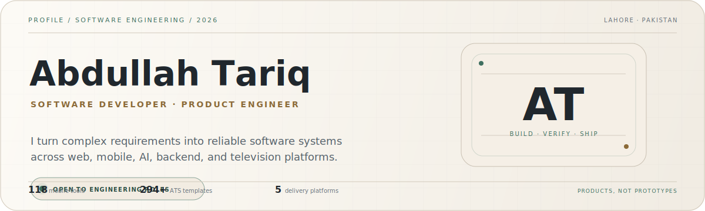

<p align="center">
  <picture>
    <source media="(prefers-color-scheme: dark)" srcset="./assets/editorial-profile-dark.svg" />
    
  </picture>
</p>

<p align="center">
  <a href="https://abdullah25.fly.dev/"><strong>Portfolio</strong></a>
  &nbsp;&nbsp;·&nbsp;&nbsp;
  <a href="https://www.linkedin.com/in/abdullah-bin-tariq-25at"><strong>LinkedIn</strong></a>
  &nbsp;&nbsp;·&nbsp;&nbsp;
  <a href="https://play.google.com/store/apps/details?id=com.abdullahtariq.netpulsepro"><strong>Google Play</strong></a>
  &nbsp;&nbsp;·&nbsp;&nbsp;
  <a href="mailto:abdullah.tariq.7654@gmail.com"><strong>Email</strong></a>
  &nbsp;&nbsp;·&nbsp;&nbsp;
  <a href="https://orcid.org/0009-0003-2603-5359"><strong>ORCID</strong></a>
</p>

> [!IMPORTANT]
> **Open to software engineering roles, internships, graduate opportunities, and meaningful product work** — Lahore, hybrid, or remote.

I build **complete product systems**: interfaces, APIs, AI workflows, native integrations, operational tooling, testing, deployment, and release hardening. I use AI to expand engineering capacity—not to replace engineering judgment.

---

## Selected work

<table>
  <tr>
    <td width="50%" valign="top">
      <p><sub>RELEASED ANDROID PRODUCT</sub></p>
      <h3>NetPulse Pro</h3>
      <p>A React Native network and technical-utility platform with <strong>118 tools</strong> across diagnostics, Wi-Fi, lookups, OSINT, privacy, security, device intelligence, and engineering utilities.</p>
      <p><kbd>React Native</kbd> <kbd>Expo</kbd> <kbd>TypeScript</kbd> <kbd>SQLite</kbd></p>
      <p><a href="https://play.google.com/store/apps/details?id=com.abdullahtariq.netpulsepro"><strong>View on Google Play →</strong></a></p>
    </td>
    <td width="50%" valign="top">
      <p><sub>AI INTERVIEW PLATFORM</sub></p>
      <h3>PrepWithAI</h3>
      <p>Full-stack interview preparation with technical and behavioral practice, voice/video workflows, a Monaco coding environment, analytics, billing, and evidence-based AI feedback.</p>
      <p><kbd>Next.js</kbd> <kbd>TypeScript</kbd> <kbd>MongoDB</kbd> <kbd>Groq</kbd></p>
      <p><a href="https://github.com/AbdullahTariq25/PrepWithAI"><strong>View repository →</strong></a></p>
    </td>
  </tr>
  <tr>
    <td width="50%" valign="top">
      <p><sub>AI CAREER TOOLKIT</sub></p>
      <h3>ResumaBuilder</h3>
      <p>Resume and career tooling with <strong>294+ ATS-ready templates</strong>, content assistance, cover letters, ATS analysis, job matching, persistence, PWA support, and document exports.</p>
      <p><kbd>Next.js</kbd> <kbd>TypeScript</kbd> <kbd>Google Gemini</kbd> <kbd>PWA</kbd></p>
      <p><a href="https://github.com/AbdullahTariq25/ResumaBuilder"><strong>View repository →</strong></a></p>
    </td>
    <td width="50%" valign="top">
      <p><sub>MULTI-PLATFORM COMMERCIAL SYSTEM</sub></p>
      <h3>Vievio</h3>
      <p>An IPTV ecosystem spanning web, mobile, Android TV, Samsung Tizen, LG webOS, provider infrastructure, backend services, monitoring, activation, and operational panels.</p>
      <p><kbd>Next.js</kbd> <kbd>React Native</kbd> <kbd>Tizen</kbd> <kbd>webOS</kbd></p>
      <p><strong>Private commercial project</strong></p>
    </td>
  </tr>
</table>

<details>
<summary><strong>Open detailed product engineering scope</strong></summary>
<br />

### NetPulse Pro

- Configuration-driven architecture for 118 tools.
- SQLite history, persistent settings, exports, themes, tests, and reusable interfaces.
- Native networking, device, sensor, file-system, notification, TCP, UDP, and BLE capabilities.

### PrepWithAI

- Technical and behavioral interview tracks, voice/video practice, company preparation, reports, and analytics.
- Groq integration using Llama 3.3 70B with retry handling, streaming responses, usage tracking, and calibrated evaluation.
- Authentication, plan enforcement, Stripe billing, transactional email, monitoring, and readiness checks.

### ResumaBuilder

- 294+ ATS-ready templates with cloud and local persistence.
- Google Gemini integration with configurable Flash-model fallbacks and an optional Pro model for more complex tasks.
- Resume content, cover letters, job matching, ATS assistance, and PDF, Word, PNG, and text exports.

### Vievio

- Web, mobile, Android TV, Samsung Tizen, and LG webOS applications.
- Provider management, activation, role-separated panels, source monitoring, playback recovery, and constrained-device optimization.

</details>

---

## AI systems and engineering judgment

<table>
  <tr>
    <td width="50%" valign="top">
      <p><sub>GOOGLE GEMINI</sub></p>
      <h3>Generation and career workflows</h3>
      <p>ResumaBuilder uses Gemini for resume content, cover-letter assistance, job matching, and career workflows, with model fallbacks and explicit error handling.</p>
      <p><kbd>Gemini Flash</kbd> <kbd>Gemini Pro</kbd> <kbd>Fallbacks</kbd></p>
    </td>
    <td width="50%" valign="top">
      <p><sub>GROQ + LLAMA</sub></p>
      <h3>Streaming and evaluation</h3>
      <p>PrepWithAI uses Groq for streaming interview responses, structured feedback, usage tracking, retry logic, and evidence-based evaluation.</p>
      <p><kbd>Llama 3.3 70B</kbd> <kbd>Streaming</kbd> <kbd>Evaluation</kbd></p>
    </td>
  </tr>
</table>

> **AI accelerates execution. Engineering controls the outcome.**

<details>
<summary><strong>Open my AI-assisted engineering playbook</strong></summary>
<br />

| Stage | Practice |
|---|---|
| **Understand** | Read source, history, logs, current behavior, architecture boundaries, and non-negotiable constraints. |
| **Map** | Identify affected surfaces, dependencies, risk, platform limitations, and stable systems that must remain untouched. |
| **Build** | Use AI for navigation, comparison, implementation alternatives, debugging, test design, and documentation—not blind generation. |
| **Prove** | Review diffs and validate through type checks, tests, builds, logs, simulators, and physical devices where required. |
| **Ship** | Harden failure states, document decisions, preserve compatibility, and deliver traceable changes. |

```text
CONTEXT → SOURCE REVIEW → CONSTRAINTS → IMPLEMENTATION → DIFF REVIEW → VERIFICATION → RELEASE
```

</details>

---

## Engineering range

<table>
  <tr>
    <td width="50%" valign="top">
      <p><sub>PRODUCT ENGINEERING</sub></p>
      <h3>Web and SaaS</h3>
      <p>Next.js, React, Vue.js, TypeScript, responsive interfaces, dashboards, authentication, billing, SSR, SEO, accessibility, performance, and production deployment.</p>
    </td>
    <td width="50%" valign="top">
      <p><sub>MOBILE AND TELEVISION</sub></p>
      <h3>Device-aware applications</h3>
      <p>React Native, Expo, Android, Samsung Tizen, LG webOS, Android TV, native modules, device APIs, remote navigation, offline state, media UX, and store delivery.</p>
    </td>
  </tr>
  <tr>
    <td width="50%" valign="top">
      <p><sub>BACKEND AND DATA</sub></p>
      <h3>APIs and operational systems</h3>
      <p>Java, Spring Boot, Node.js, REST APIs, PostgreSQL, MongoDB, MySQL, Redis, SQLite, authentication, role systems, integrations, caching, and data modeling.</p>
    </td>
    <td width="50%" valign="top">
      <p><sub>QUALITY AND DELIVERY</sub></p>
      <h3>From source to release</h3>
      <p>Testing, debugging, type checks, GitHub Actions, Docker, Vercel, Linux, logs, monitoring, simulators, physical-device validation, release hardening, and documentation.</p>
    </td>
  </tr>
</table>

---

## Experience and education

<table>
  <tr>
    <td width="50%" valign="top">
      <p><sub>CURRENT WORK</sub></p>
      <h3>Independent Software Developer</h3>
      <p><strong>2025 — Present</strong></p>
      <p>Building startup products and client systems across web, mobile, AI, television platforms, backend APIs, admin systems, and production deployments.</p>
    </td>
    <td width="50%" valign="top">
      <p><sub>CURRENT EDUCATION</sub></p>
      <h3>BS Computer Science</h3>
      <p><strong>Virtual University of Pakistan</strong><br />Oct 2025 — Expected 2029</p>
      <p>Formal computer science study alongside practical product engineering and commercial delivery.</p>
    </td>
  </tr>
</table>

<details>
<summary><strong>Open professional and education timeline</strong></summary>
<br />

| Timeline | Role or education |
|---|---|
| **2025 — Present** | **Independent Software Developer** — Startup products, client systems, mobile apps, AI products, TV applications, backend APIs, admin systems, and production deployments. |
| **Feb 2026 — Apr 2026** | **AI Data Quality Analyst / Annotator · Shenzhen-Hong Kong Smart Hub** — Annotation, validation, instruction-following review, consistency analysis, and model-training support. |
| **Aug 2025 — Feb 2026** | **Software Developer Intern · JFreaks Software Solutions** — React Native, Next.js, APIs, SSR, debugging, optimization, SEO, Git collaboration, and release support. |
| **Oct 2025 — Expected 2029** | **BS Computer Science · Virtual University of Pakistan** |
| **Nov 2024 — Jun 2025** | **Software Project Contributor / International Study · SZIIT Shenzhen** — Vue.js, TypeScript, documentation, coursework, and research-oriented implementation. |
| **Completed 2025** | **Sino-Pak Dual Diploma / DAE in Software Technology · Grade A** — SZIIT Shenzhen + PBTE / GCT Lahore. |
| **Feb 2024 — Aug 2024** | **Frontend Developer Intern · JFreaks Software Solutions** — Responsive interfaces, JavaScript, API integration, debugging, Git, and Java-related work. |

</details>

---

## Additional work

<details>
<summary><strong>Open extended project portfolio</strong></summary>
<br />

| Product | Engineering focus |
|---|---|
| **DevReviewer** | AI code review, security analysis, test generation, Big-O analysis, multi-file review, documentation, contextual chat, and auto-fix. |
| **Network Tools Hub** | 230+ networking, development, conversion, diagnostic, and technical utilities with reusable UI, APIs, SSR, and global SEO architecture. |
| **IPGeolocation.io Mobile App** | React Native contribution to a released GeoIP and network utility application. [Google Play →](https://play.google.com/store/apps/details?id=io.ipgeolocation.app) |
| **HalalCheck** | Barcode and QR scanning, OCR ingredient analysis, E-code handling, offline Room storage, and multilingual Android workflows. |
| **Domain Matching System** | Java and Spring Boot matching pipeline using exact, substring, abbreviation, scoring, and CSV-processing rules. |
| **Library Management System** | Core Java, JDBC, PostgreSQL, authentication, roles, catalog, issue, and return workflows. [Repository →](https://github.com/AbdullahTariq25/LibraryManagementSystem25) |
| **Anonymous Feedback Platform** | Authentication, anonymous messaging, moderation-oriented flows, persistence, and AI-assisted suggestions. |

</details>

<details>
<summary><strong>Open certifications and training</strong></summary>
<br />

- **AI and prompting:** Google Prompting Essentials · Claude Code in Action — Anthropic · AI Trainer / Data Annotation Training.
- **Software and security:** Ethical Hacker · JavaScript Essentials 1 and 2 · Python Essentials 1 and 2 · HTML and CSS Essentials — Cisco Networking Academy.
- **Professional development:** Agile Project Management · Data Science and Analytics — HP Foundation.
- **Earlier training:** Front-End Development — JFreaks · Python — Tang International Education Group · Chinese Language Program.

</details>

<details>
<summary><strong>Open GitHub activity</strong></summary>
<br />

<p align="center">
  
</p>

</details>

---

<div align="center">

## Build beyond the demo.

**I am interested in teams that value product ownership, careful engineering, technical growth, and meaningful user problems.**

[**Email**](mailto:abdullah.tariq.7654@gmail.com) · [**LinkedIn**](https://www.linkedin.com/in/abdullah-bin-tariq-25at) · [**Portfolio**](https://abdullah25.fly.dev/) · [**Google Play**](https://play.google.com/store/apps/details?id=com.abdullahtariq.netpulsepro)

<sub>Lahore, Pakistan · English · Urdu · Mandarin Chinese</sub>

</div>