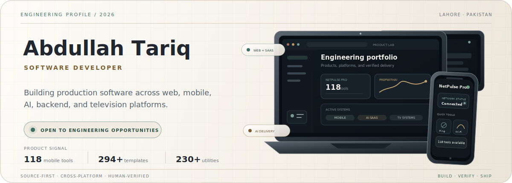
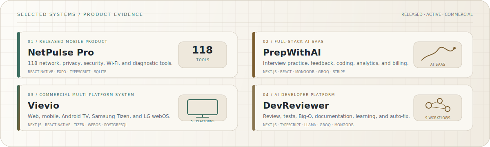
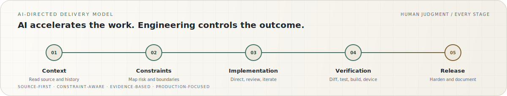
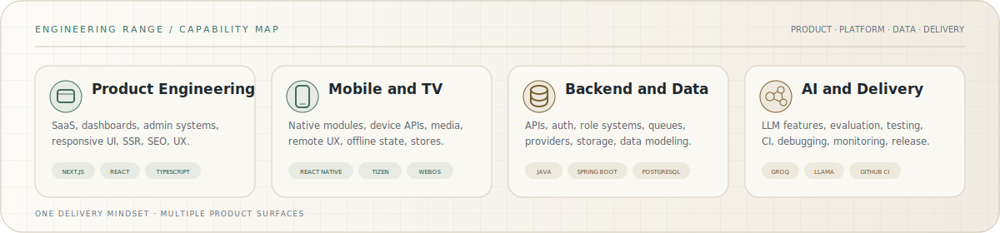
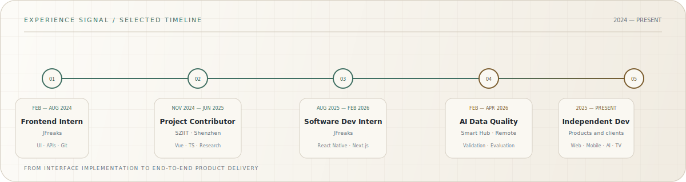

  <picture>
    <source media="(prefers-color-scheme: dark)" srcset="./assets/dossier-dark.svg" />
    
  </picture>

  <a href="https://abdullah25.fly.dev/"><strong>Portfolio</strong></a>
  &nbsp;·&nbsp;
  <a href="https://www.linkedin.com/in/abdullah-bin-tariq-25at"><strong>LinkedIn</strong></a>
  &nbsp;·&nbsp;
  <a href="https://play.google.com/store/apps/details?id=com.abdullahtariq.netpulsepro"><strong>Google Play</strong></a>
  &nbsp;·&nbsp;
  <a href="mailto:abdullah.tariq.7654@gmail.com"><strong>Email</strong></a>
  &nbsp;·&nbsp;
  <a href="https://orcid.org/0009-0003-2603-5359"><strong>ORCID</strong></a>

  <strong>Source-first engineering · AI-assisted execution · Human-verified delivery</strong>

<table>
  <tr>
    <td width="44%" valign="middle">
<pre>
╭──────────────────────────────────────╮
│                                      │
│              ╭────────╮              │
│        ──────┤ &lt;AT/&gt;  ├──────        │
│              ╰────┬───╯              │
│                   │                  │
│          ┌────────┼────────┐         │
│          │        │        │         │
│          ▼        ▼        ▼         │
│        WEB      MOBILE     AI        │
│          ╲        │        ╱         │
│           ╲       ▼       ╱          │
│            ╰── TV SYSTEMS ─╯         │
│                                      │
│   CONTEXT → BUILD → VERIFY → SHIP    │
│                                      │
╰──────────────────────────────────────╯
</pre>
      
Engineering signature · pure Markdown text

    </td>
    <td width="56%" valign="middle">
      
ABOUT / PRIMARY PROFILE

      <h2>Software developer building complete product systems.</h2>
      
I build production-oriented software across <strong>web, mobile, backend, AI, and television platforms</strong>. My strongest work appears where complex product flows, APIs, constrained devices, cross-platform reliability, and carefully directed AI-assisted development meet.

      

      
<strong>01 · Product engineering</strong> Full-stack SaaS, responsive interfaces, APIs, dashboards, and production deployment.

      
<strong>02 · Mobile and television</strong> React Native, Android, Samsung Tizen, LG webOS, and Android TV delivery.

      
<strong>03 · AI-directed development</strong> Source inspection, constraint mapping, implementation direction, testing, and evidence-based release.

      
<strong>04 · Current direction</strong> Open to engineering roles, internships, graduate opportunities, and meaningful product work.

    </td>
  </tr>
</table>

<table>
  <tr>
    <td align="center" width="25%"><strong>FULL-STACK</strong> Products and SaaS</td>
    <td align="center" width="25%"><strong>MOBILE</strong> React Native and Android</td>
    <td align="center" width="25%"><strong>AI SYSTEMS</strong> LLM features and evaluation</td>
    <td align="center" width="25%"><strong>TV PLATFORMS</strong> Tizen, webOS, Android TV</td>
  </tr>
</table>

> [!NOTE]
> **Open to software engineering opportunities** in full-stack development, React Native, AI applications, backend engineering, graduate programs, and internships — Lahore, hybrid, or remote.

---

## 01 — Featured systems

  <picture>
    <source media="(prefers-color-scheme: dark)" srcset="./assets/featured-systems-dark.svg" />
    
  </picture>

<table>
  <tr>
    <td align="center" width="25%"><a href="https://play.google.com/store/apps/details?id=com.abdullahtariq.netpulsepro"><strong>NetPulse Pro ↗</strong></a> Released Android product</td>
    <td align="center" width="25%"><a href="https://github.com/AbdullahTariq25/PrepWithAI"><strong>PrepWithAI ↗</strong></a> Public AI SaaS repository</td>
    <td align="center" width="25%"><strong>Vievio</strong> Private commercial system</td>
    <td align="center" width="25%"><strong>DevReviewer</strong> Private active development</td>
  </tr>
</table>

<strong>Open detailed engineering scope</strong>

 

### NetPulse Pro

A released React Native toolkit for network engineers, IT administrators, developers, cybersecurity learners, and technical users.

- 118 diagnostic, lookup, Wi-Fi, privacy, security, OSINT, and utility tools.
- Unified configuration-driven architecture, SQLite history, persistent settings, exports, themes, tests, and native integrations.
- Native networking, device, sensor, file-system, notification, TCP, UDP, and BLE capabilities.

`React Native` `Expo` `TypeScript` `Zustand` `SQLite`

### PrepWithAI

A full-stack interview-preparation platform built around deliberate practice, structured feedback, and measurable progress.

- Technical and behavioral tracks, voice/video practice, Monaco coding workspace, company preparation, analytics, and reports.
- Authentication, plan enforcement, Stripe billing, transactional email, monitoring, and AI feedback.

`Next.js 16` `React 19` `TypeScript` `MongoDB` `Groq` `Stripe`

### Vievio

A multi-platform IPTV ecosystem spanning consumer applications, television platforms, backend services, provider infrastructure, and operational panels.

- Web, React Native, Android TV, Samsung Tizen, and LG webOS clients.
- Provider management, activation, role-separated panels, source monitoring, playback recovery, and constrained-device optimization.

`Next.js` `React Native` `Tizen` `webOS` `PostgreSQL` `Redis`

### DevReviewer

An AI engineering workspace for code quality, tests, complexity analysis, documentation, and guided learning.

- Code review, security analysis, test generation, Big-O analysis, multi-file review, documentation, contextual chat, and auto-fix.
- Monaco editor, history, analytics, comparisons, sharing, authentication, and persistence.

`Next.js` `TypeScript` `Llama` `Groq` `MongoDB` `Monaco`

<strong>View the extended product portfolio</strong>

 

| Product | Engineering focus |
|---|---|
| **ResumaBuilder** | 294+ ATS templates, Gemini content generation, ATS analysis, cloud/local persistence, PWA support, and PDF/Word/PNG/text exports. [Repository →](https://github.com/AbdullahTariq25/ResumaBuilder) |
| **Network Tools Hub** | 230+ networking, development, conversion, diagnostic, and technical utilities using reusable UI, APIs, SSR, and global SEO architecture. |
| **IPGeolocation.io Mobile App** | React Native contribution to a released GeoIP and network-utility application. [Google Play →](https://play.google.com/store/apps/details?id=io.ipgeolocation.app) |
| **HalalCheck** | Barcode and QR scanning, OCR ingredient analysis, E-code handling, offline Room storage, and multilingual Android flows. |
| **Domain Matching System** | Java and Spring Boot matching pipeline using exact, substring, abbreviation, scoring, and CSV-processing rules. |
| **Library Management System** | Core Java, JDBC, PostgreSQL, authentication, roles, catalog, issue, and return workflows. [Repository →](https://github.com/AbdullahTariq25/LibraryManagementSystem25) |
| **Anonymous Feedback Platform** | Authentication, anonymous messaging, moderation-oriented flows, persistence, and AI-assisted suggestions. |

---

## 02 — AI-directed delivery

  <picture>
    <source media="(prefers-color-scheme: dark)" srcset="./assets/delivery-dark.svg" />
    
  </picture>

<table>
  <tr>
    <td width="33%" valign="top"><strong>Understand</strong> Read source, history, current behavior, architecture boundaries, and non-negotiable constraints.</td>
    <td width="33%" valign="top"><strong>Direct</strong> Use AI for navigation, comparison, implementation, debugging, documentation, and test design without surrendering technical judgment.</td>
    <td width="33%" valign="top"><strong>Prove</strong> Review diffs and verify through type checks, tests, builds, logs, simulators, and physical devices where required.</td>
  </tr>
</table>

> **AI accelerates the work. Engineering controls the outcome.**

This is how I coordinate AI across large codebases while keeping output **traceable, constraint-aware, technically grounded, and production-focused**.

---

## 03 — Engineering range

  <picture>
    <source media="(prefers-color-scheme: dark)" srcset="./assets/capabilities-dark.svg" />
    
  </picture>

<strong>View the complete technology stack</strong>

 

| Area | Technology and practice |
|---|---|
| **Product engineering** | Next.js, React, Vue.js, TypeScript, JavaScript, Tailwind CSS, responsive UI, accessibility, SSR, SEO, performance, design systems, dashboards, and admin products. |
| **Mobile and television** | React Native, Expo, Android Java/XML, Samsung Tizen, LG webOS, Android TV, native modules, remote navigation, media interfaces, offline state, and store delivery. |
| **Backend and data** | Java, Spring Boot, Node.js, REST APIs, PostgreSQL, MongoDB, MySQL, Redis, SQLite, authentication, role systems, provider integrations, and data modeling. |
| **AI, quality, and delivery** | Groq, Llama, Gemini, structured prompting, LLM integration, evaluation, testing, GitHub Actions, Docker, Vercel, monitoring, debugging, QA, and release hardening. |

---

## 04 — Experience

  <picture>
    <source media="(prefers-color-scheme: dark)" srcset="./assets/experience-dark.svg" />
    
  </picture>

<strong>View role contributions</strong>

 

**Independent Software Developer** · Startup products and client systems  
`2025 — Present`

Building and improving web platforms, mobile applications, AI-enabled products, television applications, backend APIs, admin systems, and production deployments, including work delivered through Taknea Solutions.

**Software Developer Intern** · JFreaks Software Solutions  
`Aug 2025 — Feb 2026`

React Native delivery, Next.js platforms, API integration, SSR, debugging, performance optimization, SEO, Git collaboration, and release support.

**AI Data Quality Analyst / Annotator — Contract** · Shenzhen-Hong Kong Smart Hub  
`Feb 2026 — Apr 2026` · Remote

Dataset annotation, validation, quality review, instruction-following checks, consistency analysis, and model-training support.

**Software Project Contributor** · Shenzhen Institute of Information Technology  
`Nov 2024 — Jun 2025` · Shenzhen, China

Vue.js and TypeScript project components, technical documentation, software coursework, and research-oriented implementation support during international study.

**Frontend Developer Intern** · JFreaks Software Solutions  
`Feb 2024 — Aug 2024`

Responsive interfaces, JavaScript, API integration, debugging, Git, Java-related tasks, and practical software-development workflows.

---

## 05 — Education and credentials

<table>
  <tr>
    <td width="50%" valign="top">
      
CURRENT EDUCATION

      <h3>BS Computer Science</h3>
      
<strong>Virtual University of Pakistan</strong> Oct 2025 — Expected 2029

    </td>
    <td width="50%" valign="top">
      
INTERNATIONAL TECHNICAL EDUCATION

      <h3>Sino-Pak Dual Diploma / DAE</h3>
      
<strong>Software Technology · Grade A</strong> SZIIT Shenzhen + PBTE / GCT Lahore · Completed 2025

    </td>
  </tr>
</table>

**International background:** On-campus study in Shenzhen, China, from November 2024 to June 2025. Mandarin Chinese communication at approximately HSK 3 level.

<strong>View certifications and earlier education</strong>

 

- **AI and prompting:** Google Prompting Essentials · Claude Code in Action — Anthropic · AI Trainer / Data Annotation Training.
- **Software and security:** Ethical Hacker · JavaScript Essentials 1 and 2 · Python Essentials 1 and 2 · HTML and CSS Essentials — Cisco Networking Academy.
- **Professional development:** Agile Project Management · Data Science and Analytics — HP Foundation.
- **Earlier training:** Front-End Development — JFreaks · Python — Tang International Education Group · Chinese Language Program.
- **Matriculation:** Computer Science / Science — Unique Group of Institutions, BISE Lahore · Completed 2022.

<strong>View GitHub activity</strong>

 

  

---

## Build beyond the demo.

I am interested in teams that value real product ownership, careful engineering, technical mentorship, and meaningful user problems.

[**Email**](mailto:abdullah.tariq.7654@gmail.com) · [**LinkedIn**](https://www.linkedin.com/in/abdullah-bin-tariq-25at) · [**Portfolio**](https://abdullah25.fly.dev/) · [**Google Play**](https://play.google.com/store/apps/details?id=com.abdullahtariq.netpulsepro)

Lahore, Pakistan · English · Urdu · Mandarin Chinese

