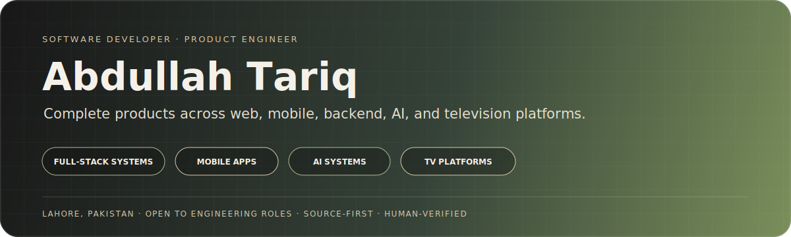
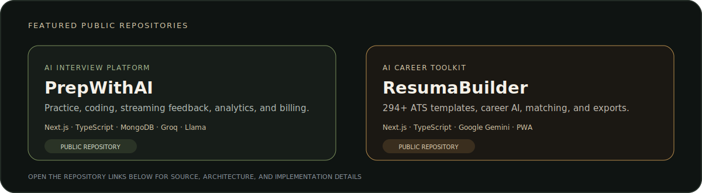
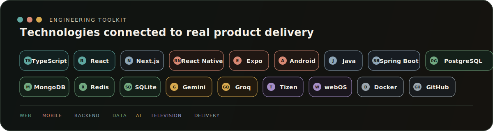
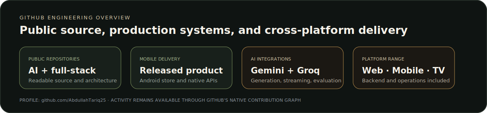

<div align="center">



[**Portfolio**](https://abdullah25.fly.dev/) · [**LinkedIn**](https://www.linkedin.com/in/abdullah-bin-tariq-25at) · [**Google Play**](https://play.google.com/store/apps/details?id=com.abdullahtariq.netpulsepro) · [**Email**](mailto:abdullah.tariq.7654@gmail.com) · [**ORCID**](https://orcid.org/0009-0003-2603-5359)

</div>

## 👋 About me

I am a **software developer and product engineer** based in Lahore, Pakistan. I design, build, debug, and deliver complete software systems across web, mobile, backend, artificial intelligence, and television platforms.

My work goes beyond interface development. I handle product architecture, APIs, data models, authentication, native integrations, operational panels, deployment, testing, performance, failure recovery, and release hardening. I use AI as an engineering accelerator while keeping technical decisions, verification, and delivery accountability human-owned.

<table>
  <tr>
    <td width="50%" valign="top">
      <p><sub>💼 CURRENT WORK</sub></p>
      <h3>Independent Software Developer</h3>
      <p>Building startup products and client systems across full-stack web, React Native, backend services, AI applications, Android, Samsung Tizen, LG webOS, and Android TV.</p>
    </td>
    <td width="50%" valign="top">
      <p><sub>🎓 CURRENT EDUCATION</sub></p>
      <h3>BS Computer Science</h3>
      <p><strong>Virtual University of Pakistan</strong><br />Oct 2025 — Expected 2029</p>
    </td>
  </tr>
  <tr>
    <td width="50%" valign="top">
      <p><sub>🌏 INTERNATIONAL BACKGROUND</sub></p>
      <h3>Software Technology · Grade A</h3>
      <p>Sino-Pak Dual Diploma / DAE through SZIIT Shenzhen and PBTE / GCT Lahore, including on-campus technical study in Shenzhen, China.</p>
    </td>
    <td width="50%" valign="top">
      <p><sub>🗣 COMMUNICATION</sub></p>
      <h3>English · Urdu · Mandarin</h3>
      <p>Professional communication in English and Urdu, with Mandarin Chinese communication at approximately HSK 3 level.</p>
    </td>
  </tr>
</table>

> **Current direction:** Open to software engineering roles, internships, graduate opportunities, collaborations, and meaningful product work—Lahore, hybrid, or remote.

---

## 🚀 Featured work

My public repositories demonstrate source-level implementation and architecture. My released and commercial systems demonstrate delivery across app stores, backend infrastructure, mobile devices, and television platforms.

<p align="center">
  
</p>

<p align="center">
  <a href="https://github.com/AbdullahTariq25/PrepWithAI"><strong>Open PrepWithAI →</strong></a>
  &nbsp;&nbsp;·&nbsp;&nbsp;
  <a href="https://github.com/AbdullahTariq25/ResumaBuilder"><strong>Open ResumaBuilder →</strong></a>
</p>

### ◆ Product portfolio

| Product | Product evidence | Core stack |
|---|---|---|
| [**NetPulse Pro**](https://play.google.com/store/apps/details?id=com.abdullahtariq.netpulsepro) | Released Android network and technical-utility product covering diagnostics, Wi-Fi, lookups, OSINT, privacy, security, device intelligence, and engineering workflows | React Native, Expo, TypeScript, Zustand, SQLite |
| [**PrepWithAI**](https://github.com/AbdullahTariq25/PrepWithAI) | Full-stack interview-preparation platform with technical and behavioral practice, Monaco coding, streaming AI feedback, analytics, subscriptions, and production controls | Next.js, TypeScript, MongoDB, Groq, Llama, Stripe |
| [**ResumaBuilder**](https://github.com/AbdullahTariq25/ResumaBuilder) | AI-assisted resume and career platform with a large ATS-ready template system, content generation, cover letters, job matching, analysis, persistence, PWA support, and document exports | Next.js, TypeScript, Google Gemini, PWA |
| **Vievio** | Commercial IPTV ecosystem spanning consumer applications, backend infrastructure, provider operations, monitoring, activation, and television clients | React Native, Next.js, PostgreSQL, Redis, Tizen, webOS, Android TV |

<details>
<summary><strong>Open complete product engineering details</strong></summary>
<br />

### NetPulse Pro

- Configuration-driven architecture supporting a broad set of networking and technical tools.
- SQLite history, persistent settings, exports, themes, testing, and reusable interfaces.
- Native networking, device, sensor, file-system, notification, TCP, UDP, and BLE capabilities.

### PrepWithAI

- Technical and behavioral interview tracks, voice/video practice, company preparation, reports, and analytics.
- Groq integration using Llama 3.3 70B with retries, streaming, API usage tracking, and calibrated evaluation.
- Authentication, plan enforcement, Stripe billing, transactional email, monitoring, and readiness checks.

### ResumaBuilder

- Large ATS-ready resume template system with cloud and local persistence.
- Google Gemini integration with configurable Flash-family fallbacks and an optional Pro model.
- Resume content, cover letters, job matching, ATS assistance, and PDF, Word, PNG, and text exports.

### Vievio

- Web, React Native mobile, Android TV, Samsung Tizen, and LG webOS applications.
- Provider management, activation, role-separated panels, source monitoring, playback recovery, and constrained-device optimization.

</details>

---

## 🤖 AI systems and engineering judgment

The products above use AI in distinct, production-oriented ways: **Gemini for generative career workflows** and **Groq/Llama for low-latency interview interaction and structured evaluation**.

<table>
  <tr>
    <td width="50%" valign="top">
      <p><sub>🟡 GOOGLE GEMINI · RESUMABUILDER</sub></p>
      <h3>Generation with resilience</h3>
      <p>Gemini supports resume content, cover letters, job matching, and ATS-oriented workflows through configurable Flash-model fallbacks, an optional Pro model, and explicit error handling.</p>
      <p><kbd>Gemini Flash</kbd> <kbd>Gemini Pro</kbd> <kbd>Fallback strategy</kbd></p>
    </td>
    <td width="50%" valign="top">
      <p><sub>🟢 GROQ + LLAMA · PREPWITHAI</sub></p>
      <h3>Streaming with evaluation</h3>
      <p>Groq serves streaming interview responses and evidence-based feedback using Llama 3.3 70B, retry handling, usage tracking, structured output, and calibrated scoring.</p>
      <p><kbd>Llama 3.3 70B</kbd> <kbd>Streaming</kbd> <kbd>Evaluation</kbd></p>
    </td>
  </tr>
</table>

> **AI accelerates execution. Engineering controls the outcome.**

<details>
<summary><strong>Open my source-first engineering workflow</strong></summary>
<br />

| Stage | What I do |
|---|---|
| **Understand** | Read source, history, logs, current behavior, architecture boundaries, and non-negotiable constraints. |
| **Map** | Identify affected surfaces, dependencies, platform limitations, failure risks, and stable systems that must remain untouched. |
| **Build** | Use AI for navigation, comparison, implementation alternatives, debugging, test design, and documentation—not blind generation. |
| **Prove** | Review diffs and validate through type checks, tests, builds, logs, simulators, and physical devices where required. |
| **Ship** | Harden failure states, preserve compatibility, document decisions, and release traceable changes. |

```text
CONTEXT → SOURCE REVIEW → CONSTRAINTS → IMPLEMENTATION → DIFF REVIEW → VERIFICATION → RELEASE
```

</details>

---

## 🧰 Engineering toolkit

The stack below connects directly to the product work above—from interfaces and native applications to APIs, persistence, AI, infrastructure, and release verification.

<p align="center">
  
</p>

<table>
  <tr>
    <td width="50%" valign="top"><strong>🟦 Product engineering</strong><br /><sub>Responsive UI, dashboards, authentication, billing, SSR, SEO, accessibility, performance, APIs, and deployment.</sub></td>
    <td width="50%" valign="top"><strong>🟥 Mobile and television</strong><br /><sub>React Native, Expo, Android, Tizen, webOS, Android TV, native modules, device APIs, remote navigation, and media UX.</sub></td>
  </tr>
  <tr>
    <td width="50%" valign="top"><strong>🟩 Backend and data</strong><br /><sub>Java, Spring Boot, Node.js, REST, PostgreSQL, MongoDB, MySQL, Redis, SQLite, authentication, caching, and integrations.</sub></td>
    <td width="50%" valign="top"><strong>🟨 Quality and delivery</strong><br /><sub>Testing, debugging, type checks, GitHub Actions, Docker, Linux, logs, monitoring, simulators, device validation, and release hardening.</sub></td>
  </tr>
</table>

---

## 📈 GitHub activity

<p align="center">
  
</p>

The native contribution graph, repository history, releases, and source code remain available directly on my GitHub profile and repositories without depending on external statistics services.

---

## 💼 Experience and education

<table>
  <tr>
    <td width="50%" valign="top">
      <p><sub>SOFTWARE DELIVERY</sub></p>
      <h3>Independent Software Developer</h3>
      <p><strong>2025 — Present</strong></p>
      <p>Building startup products and client systems across web, mobile, AI, television, backend APIs, admin systems, and production deployment, including work delivered through Taknea Solutions.</p>
    </td>
    <td width="50%" valign="top">
      <p><sub>FORMAL EDUCATION</sub></p>
      <h3>BS Computer Science</h3>
      <p><strong>Virtual University of Pakistan</strong><br />Oct 2025 — Expected 2029</p>
      <p>Continuing formal computer science study alongside practical product engineering and commercial software delivery.</p>
    </td>
  </tr>
</table>

<details>
<summary><strong>Open professional and education timeline</strong></summary>
<br />

| Timeline | Role or education |
|---|---|
| **2025 — Present** | **Independent Software Developer** — Full-stack products, mobile apps, AI systems, TV applications, backend APIs, admin systems, and production deployments |
| **Feb 2026 — Apr 2026** | **AI Data Quality Analyst / Annotator · Shenzhen-Hong Kong Smart Hub** — Dataset annotation, validation, consistency analysis, instruction-following review, and model-training support |
| **Aug 2025 — Feb 2026** | **Software Developer Intern · JFreaks Software Solutions** — React Native, Next.js, APIs, SSR, debugging, optimization, SEO, Git collaboration, and release support |
| **Oct 2025 — Expected 2029** | **BS Computer Science · Virtual University of Pakistan** |
| **Nov 2024 — Jun 2025** | **International technical study and software project work · SZIIT Shenzhen** — Vue.js, TypeScript, technical documentation, coursework, and implementation support |
| **Completed 2025** | **Sino-Pak Dual Diploma / DAE in Software Technology · Grade A** — SZIIT Shenzhen + PBTE / GCT Lahore |
| **Feb 2024 — Aug 2024** | **Frontend Developer Intern · JFreaks Software Solutions** — Responsive interfaces, JavaScript, API integration, debugging, Git, and Java-related work |

</details>

<details>
<summary><strong>Open additional projects and credentials</strong></summary>
<br />

**Additional products:** DevReviewer · Network Tools Hub · IPGeolocation.io Mobile App · HalalCheck · Domain Matching System · Library Management System · Anonymous Feedback Platform

**AI and prompting:** Google Prompting Essentials · Claude Code in Action · AI Trainer / Data Annotation Training

**Software and security:** Ethical Hacker · JavaScript Essentials · Python Essentials · HTML and CSS Essentials

**Professional development:** Agile Project Management · Data Science and Analytics

</details>

---

<div align="center">

### Build beyond the demo.

I am interested in teams that value product ownership, careful engineering, technical growth, and meaningful user problems.

[**Portfolio**](https://abdullah25.fly.dev/) · [**LinkedIn**](https://www.linkedin.com/in/abdullah-bin-tariq-25at) · [**Email**](mailto:abdullah.tariq.7654@gmail.com)

<sub>Lahore, Pakistan · English · Urdu · Mandarin Chinese</sub>

</div>