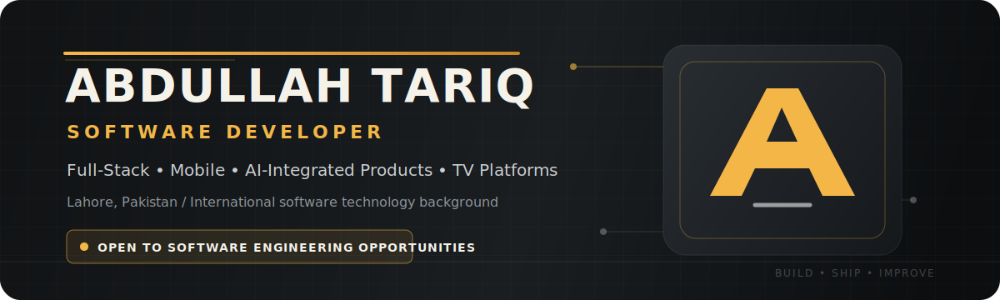

  

  
  
  
  
  

  <strong>Software developer building production-oriented web platforms, mobile applications, AI-enabled SaaS products, backend systems, and television applications.</strong>

  Currently working on <strong>startup products, client software, and independent engineering projects</strong> while pursuing a BS in Computer Science.
   
  Open to <strong>software engineering, full-stack, React Native, AI application, graduate, and internship opportunities</strong> — remote, hybrid, or on-site.

---

## Professional Snapshot

<table>
  <tr>
    <td align="center" width="25%"><strong>2+ Years</strong> Practical development experience</td>
    <td align="center" width="25%"><strong>118 Tools</strong> Current NetPulse Pro architecture</td>
    <td align="center" width="25%"><strong>230+ Utilities</strong> Network Tools Hub</td>
    <td align="center" width="25%"><strong>4 Product Surfaces</strong> Web · Mobile · Backend · TV</td>
  </tr>
</table>

I work across the complete product lifecycle: understanding requirements, planning architecture, developing frontend and backend systems, integrating APIs and AI models, testing cross-platform behavior, debugging production issues, and preparing reliable releases.

My strongest areas are **Next.js**, **React Native**, **TypeScript**, **Java**, **Spring Boot**, **REST APIs**, **PostgreSQL**, **MongoDB**, and practical **LLM integration**. I also have hands-on experience with **Samsung Tizen**, **LG webOS**, Android TV, authentication systems, admin panels, deployment workflows, and release hardening.

---

## Featured Engineering Work

### NetPulse Pro — Android Network Toolkit

> A released React Native application designed for network engineers, IT administrators, developers, students, and technical users.

- Current codebase registers **118 network, diagnostic, lookup, privacy, security, Wi-Fi, OSINT, and utility tools**.
- Built around a unified, configuration-driven component architecture across the complete toolkit.
- Includes SQLite history, persistent settings, native device/network integrations, multi-theme support, exports, and test infrastructure.
- Uses React Navigation, Zustand, Expo modules, native TCP/UDP/BLE helpers, and TypeScript.

**Stack:** `React Native` `Expo` `TypeScript` `Zustand` `SQLite` `Native Networking`

[View on Google Play](https://play.google.com/store/apps/details?id=com.abdullahtariq.netpulsepro)

---

### [PrepWithAI](https://github.com/AbdullahTariq25/PrepWithAI) — Interview Preparation SaaS

> A full-stack interview preparation platform for software developers, built around measurable practice and structured feedback.

- AI-led mock interviews covering DSA, system design, behavioral, frontend, backend, DevOps, mobile, ML, and leadership tracks.
- Voice/video modes, Monaco coding workspace, company-specific preparation, progress analytics, career tools, and session reports.
- Authentication, free/pro/team access models, subscription infrastructure, transactional email, analytics, and monitoring integrations.

**Stack:** `Next.js 16` `React 19` `TypeScript` `MongoDB` `Groq` `Stripe` `Auth.js`

---

### DevReviewer — AI Developer Platform

> A multi-tool AI platform for code quality, testing, documentation, complexity analysis, and developer learning.

- Combines **9 AI-powered workflows**, including code review, test generation, Big-O analysis, multi-file review, documentation, learning mode, auto-fix, contextual chat, and resume support.
- Includes Monaco-based editing, review history, analytics, comparisons, public review links, authentication, and MongoDB persistence.
- Detects bugs, security risks, anti-patterns, performance issues, and maintainability problems with structured quality scoring.

**Stack:** `Next.js` `TypeScript` `Llama 3.3 via Groq` `MongoDB` `NextAuth` `Monaco`

Repository is private while the product is being developed and hardened.

---

### [ResumaBuilder](https://github.com/AbdullahTariq25/ResumaBuilder) — AI Resume Platform

> An ATS-focused resume builder combining structured editing, AI assistance, extensive templates, and multi-format exports.

- Includes **294+ resume templates**, real-time ATS scoring, Gemini-powered content generation, optional authentication, and cloud/local persistence.
- Supports PDF, Word, PNG, and text exports, email delivery, PWA installation, keyboard workflows, dark mode, and responsive editing.
- Includes validation, security headers, API rate limiting, component tests, monitoring, and analytics integrations.

**Stack:** `Next.js 16` `React 19` `TypeScript` `Gemini` `MongoDB` `Zustand` `Vitest`

---

### Vievio — Multi-Platform IPTV Product Ecosystem

> A full product ecosystem spanning user-facing applications, TV platforms, backend services, provider management, and administrative systems.

- Covers web, React Native mobile, Android TV, Samsung Tizen, LG webOS, user/reseller/admin panels, and backend services.
- Includes M3U/M3U8 and Xtream provider workflows, activation and device management, playback recovery, source monitoring, and account infrastructure.
- Developed with attention to remote-control navigation, constrained TV hardware, media playback stability, large playlist synchronization, and cross-platform UX.

**Stack:** `Next.js` `React Native` `Android` `Tizen` `webOS` `PostgreSQL` `Redis` `REST APIs`

Commercial repository is private.

---

### Network Tools Hub — Large-Scale Web Utility Platform

> A search-oriented developer platform containing more than 230 networking, conversion, diagnostic, and general-purpose tools.

- Structured for large-scale tool discovery, reusable interfaces, responsive behavior, API integration, and global SEO coverage.
- Developed through JFreaks Software Solutions as part of full-stack and product delivery work.

**Stack:** `Next.js` `TypeScript` `Tailwind CSS` `REST APIs` `SSR / SEO`

---

<strong>Additional selected projects</strong>

 

| Project | Engineering scope |
|---|---|
| **IPGeolocation.io Mobile App** | React Native contribution to a released GeoIP and network-utilities application with IP lookup, DNS, diagnostics, converters, and security-context tools. [Google Play](https://play.google.com/store/apps/details?id=io.ipgeolocation.app) |
| **HalalApp / HalalCheck** | Android product using barcode/QR scanning, OCR, E-code handling, offline storage, multilingual content, and ingredient-checking workflows. |
| **Domain Matching System** | Java and Spring Boot matching pipeline using exact, substring, abbreviation, scoring, and CSV-processing rules. |
| **Library Management System** | Core Java, JDBC, and PostgreSQL application with authentication, admin/user roles, catalog management, issue, and return workflows. [Repository](https://github.com/AbdullahTariq25/LibraryManagementSystem25) |
| **Anonymous Feedback Platform** | Full-stack feedback product with authentication, anonymous messaging, moderation-oriented flows, and AI-assisted suggestions. |

---

## Technical Capability

<table>
  <tr>
    <td valign="top" width="50%">
      <strong>Frontend & Product UI</strong>  
      Next.js · React · Vue.js · TypeScript · JavaScript 
      Tailwind CSS · Responsive UI · SSR · Accessibility 
      State management · Design systems · Performance
    </td>
    <td valign="top" width="50%">
      <strong>Mobile & Television</strong>  
      React Native · Expo · Android Java/XML 
      Android TV · Samsung Tizen · LG webOS 
      Remote navigation · Native modules · Media UX
    </td>
  </tr>
  <tr>
    <td valign="top" width="50%">
      <strong>Backend & Data</strong>  
      Java · Spring Boot · Node.js · REST APIs 
      PostgreSQL · MongoDB · MySQL · Redis · SQLite 
      Authentication · Admin systems · API integration
    </td>
    <td valign="top" width="50%">
      <strong>AI, Quality & Delivery</strong>  
      Groq · Llama · Gemini · LLM API integration 
      Prompt design · Structured outputs · AI evaluation 
      GitHub Actions · Docker · Vercel · Testing · QA
    </td>
  </tr>
</table>

  

---

## Experience

| Period | Position | Organization / Context | Selected contribution |
|---|---|---|---|
| **2025 – Present** | **Independent Software Developer** | Startup products and client projects | Building and improving full-stack platforms, mobile apps, AI-enabled products, TV applications, APIs, admin systems, and production deployments, including work delivered through Taknea Solutions. |
| **Aug 2025 – Feb 2026** | **Software Developer Intern** | JFreaks Software Solutions | React Native application delivery, Next.js platforms, APIs, SSR, debugging, performance work, SEO, Git collaboration, and production release support. |
| **Feb 2026 – Apr 2026** | **AI Data Quality Analyst / Annotator — Contract** | Shenzhen-Hong Kong Smart Hub · Remote | Dataset annotation, validation, quality review, instruction-following checks, consistency analysis, and model-training support. |
| **Nov 2024 – Jun 2025** | **Research & Software Project Contributor** | Shenzhen Institute of Information Technology | Vue.js and TypeScript project components, technical documentation, software coursework, and research-oriented project support during international study. |
| **Feb 2024 – Aug 2024** | **Frontend Developer Intern** | JFreaks Software Solutions | Responsive interfaces, JavaScript, frontend implementation, Java-related tasks, API integration, debugging, Git, and practical software-development workflows. |

---

## Education

<table>
  <tr>
    <td width="32%"><strong>BS Computer Science</strong></td>
    <td width="44%">Virtual University of Pakistan</td>
    <td>Oct 2025 – Expected 2029</td>
  </tr>
  <tr>
    <td><strong>Sino-Pak Dual Diploma / DAE</strong> Software Technology · Grade A</td>
    <td>Shenzhen Institute of Information Technology + PBTE / Government College of Technology, Lahore</td>
    <td>2022 – 2025</td>
  </tr>
  <tr>
    <td><strong>Matriculation</strong> Computer Science / Science</td>
    <td>Unique Group of Institutions · BISE Lahore</td>
    <td>2020 – 2022</td>
  </tr>
</table>

**International background:** Studied on campus in Shenzhen, China, from November 2024 to June 2025. Mandarin Chinese communication is approximately HSK 3 level.

---

## Certifications & Training

| Area | Selected credentials |
|---|---|
| **AI & Prompting** | Google Prompting Essentials · Claude Code in Action — Anthropic · AI Trainer / Data Annotation Training |
| **Software & Security** | Ethical Hacker — Cisco · JavaScript Essentials 1 & 2 — Cisco · Python Essentials 1 & 2 — Cisco · HTML & CSS Essentials — Cisco |
| **Professional Skills** | Agile Project Management — HP Foundation · Data Science & Analytics — HP Foundation |
| **Earlier Training** | Front-End Development — JFreaks Software Solutions · Python — Tang International Education Group · Chinese Language Program |

---

## GitHub Engineering Activity

  

  
  
  

---

## Opportunities & Contact

I am interested in roles where I can contribute to real product development while continuing to grow through strong engineering practices, technical mentorship, and meaningful user problems.

**Roles of interest:** Software Engineer · Full-Stack Developer · React Native Developer · AI Application Developer · Junior Backend Developer · Graduate / Internship Programs

**Work modes:** Lahore on-site or hybrid · Pakistan remote · International remote opportunities

  
  

  Lahore, Pakistan · English · Urdu · Mandarin Chinese

