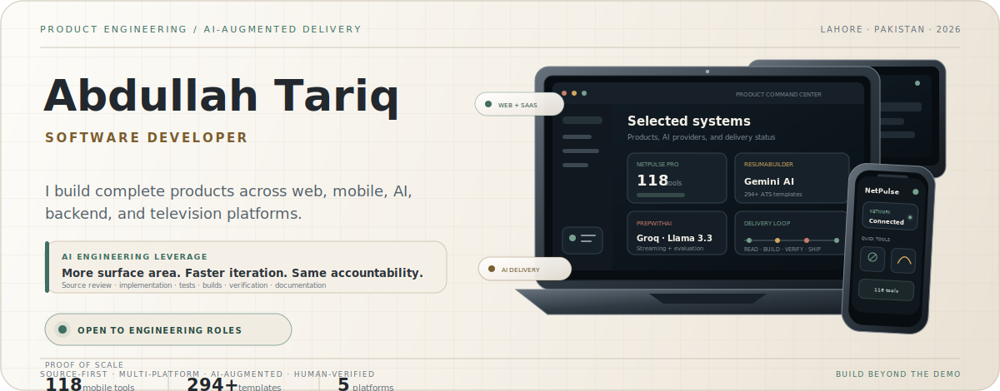
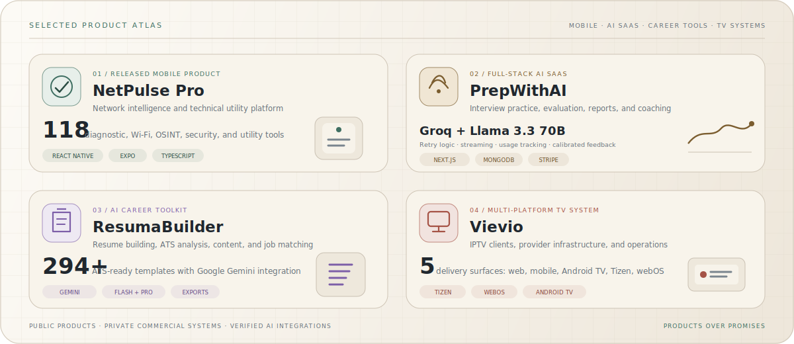

<p align="center">
  <picture>
    <source media="(prefers-color-scheme: dark)" srcset="./assets/engineering-workspace-dark.svg" />
    
  </picture>
</p>

<p align="center">
  <a href="https://abdullah25.fly.dev/"><strong>Portfolio</strong></a>
  &nbsp;·&nbsp;
  <a href="https://www.linkedin.com/in/abdullah-bin-tariq-25at"><strong>LinkedIn</strong></a>
  &nbsp;·&nbsp;
  <a href="https://play.google.com/store/apps/details?id=com.abdullahtariq.netpulsepro"><strong>Google Play</strong></a>
  &nbsp;·&nbsp;
  <a href="mailto:abdullah.tariq.7654@gmail.com"><strong>Email</strong></a>
  &nbsp;·&nbsp;
  <a href="https://orcid.org/0009-0003-2603-5359"><strong>ORCID</strong></a>
</p>

> [!IMPORTANT]
> **Open to software engineering roles, internships, graduate opportunities, and meaningful product work** — Lahore, hybrid, or remote.

<p align="center">
  <strong>I do not use AI as a substitute for engineering. I use it to operate across more engineering surface area—source review, dependency tracing, implementation, testing, verification, and documentation—while retaining responsibility for every technical decision.</strong>
</p>

<table>
  <tr>
    <td align="center" width="25%"><strong>FULL-STACK</strong><br /><sub>Products, SaaS, dashboards</sub></td>
    <td align="center" width="25%"><strong>MOBILE</strong><br /><sub>React Native, Expo, Android</sub></td>
    <td align="center" width="25%"><strong>AI SYSTEMS</strong><br /><sub>Gemini, Groq, evaluation</sub></td>
    <td align="center" width="25%"><strong>TV PLATFORMS</strong><br /><sub>Tizen, webOS, Android TV</sub></td>
  </tr>
</table>

<details>
<summary><strong>Open my AI engineering playbook</strong></summary>
<br />

<table>
  <tr>
    <td width="33%" valign="top"><strong>01 · Inspect deeper</strong><br /><sub>Read source, history, logs, architecture boundaries, dependencies, and non-negotiable constraints before changing code.</sub></td>
    <td width="33%" valign="top"><strong>02 · Direct deliberately</strong><br /><sub>Use AI for navigation, comparison, implementation alternatives, debugging, test design, and documentation—not blind generation.</sub></td>
    <td width="33%" valign="top"><strong>03 · Prove the result</strong><br /><sub>Review diffs and verify through type checks, tests, builds, logs, simulators, and physical devices where the platform requires it.</sub></td>
  </tr>
</table>

```text
CONTEXT → SOURCE REVIEW → CONSTRAINT MAP → IMPLEMENTATION → DIFF REVIEW → TESTS / BUILDS / DEVICES → RELEASE
```

This workflow lets me cover broader engineering scope than a normal one-person implementation loop while keeping the work **traceable, constraint-aware, and human-verified**.

</details>

---

## 01 — Selected product systems

<p align="center">
  <picture>
    <source media="(prefers-color-scheme: dark)" srcset="./assets/product-atlas-dark.svg" />
    
  </picture>
</p>

<table>
  <tr>
    <td align="center" width="25%"><a href="https://play.google.com/store/apps/details?id=com.abdullahtariq.netpulsepro"><strong>NetPulse Pro ↗</strong></a><br /><sub>Released Android product</sub></td>
    <td align="center" width="25%"><a href="https://github.com/AbdullahTariq25/PrepWithAI"><strong>PrepWithAI ↗</strong></a><br /><sub>Public AI SaaS repository</sub></td>
    <td align="center" width="25%"><a href="https://github.com/AbdullahTariq25/ResumaBuilder"><strong>ResumaBuilder ↗</strong></a><br /><sub>Public AI career toolkit</sub></td>
    <td align="center" width="25%"><strong>Vievio</strong><br /><sub>Private commercial platform</sub></td>
  </tr>
</table>

<details>
<summary><strong>Open product engineering details</strong></summary>
<br />

### NetPulse Pro

A released React Native network toolkit for engineers, developers, IT administrators, cybersecurity learners, and technical users.

- **118 tools** across diagnostics, Wi-Fi, lookups, OSINT, privacy, security, device intelligence, and technical utilities.
- Configuration-driven tool architecture, SQLite history, exports, themes, persistent settings, tests, and native integrations.
- Networking, device, sensor, file-system, notification, TCP, UDP, and BLE capabilities.

`React Native` `Expo` `TypeScript` `Zustand` `SQLite`

### PrepWithAI

A full-stack interview-preparation platform built around deliberate practice, measurable feedback, and structured career workflows.

- Technical and behavioral interviews, voice/video practice, Monaco coding workspace, company preparation, analytics, and reports.
- Groq integration with Llama 3.3 70B, retry logic, streaming responses, usage tracking, and calibrated interview evaluation.
- Authentication, plan enforcement, Stripe billing, transactional email, monitoring, and production checks.

`Next.js` `React` `TypeScript` `MongoDB` `Groq` `Stripe`

### ResumaBuilder

An AI-assisted resume and career toolkit with a large template system, ATS analysis, content assistance, job matching, and exports.

- **294+ ATS-ready templates** with cloud and local persistence.
- Google Gemini integration using configurable Flash-family fallbacks and an optional Pro model for more complex tasks.
- Resume content, cover letters, job matching, ATS assistance, and PDF/Word/PNG/text exports.

`Next.js` `TypeScript` `Google Gemini` `PWA` `Document Exports`

### Vievio

A multi-platform IPTV ecosystem spanning consumer clients, television applications, provider infrastructure, backend services, and operational panels.

- Web, React Native mobile, Android TV, Samsung Tizen, and LG webOS delivery surfaces.
- Provider management, activation, role-separated panels, source monitoring, playback recovery, and constrained-device optimization.

`Next.js` `React Native` `Tizen` `webOS` `PostgreSQL` `Redis`

</details>

---

## 02 — Verified AI integrations

<table>
  <tr>
    <td width="33%" valign="top">
      <p><sub>GOOGLE GEMINI</sub></p>
      <h3>ResumaBuilder</h3>
      <p>Gemini supports resume content, cover-letter assistance, job matching, and career workflows through configurable Flash-model fallbacks and an optional Pro model.</p>
      <p><kbd>Generation</kbd> <kbd>Career AI</kbd> <kbd>Fallbacks</kbd></p>
    </td>
    <td width="33%" valign="top">
      <p><sub>GROQ + LLAMA</sub></p>
      <h3>PrepWithAI</h3>
      <p>Groq serves streaming interview responses and evidence-based evaluation using Llama 3.3 70B, retry handling, usage tracking, and structured feedback.</p>
      <p><kbd>Streaming</kbd> <kbd>Evaluation</kbd> <kbd>Tracking</kbd></p>
    </td>
    <td width="33%" valign="top">
      <p><sub>AI-AUGMENTED ENGINEERING</sub></p>
      <h3>My delivery method</h3>
      <p>I use AI to inspect faster, compare wider, implement deliberately, test aggressively, and document clearly—without outsourcing technical judgment.</p>
      <p><kbd>Source-first</kbd> <kbd>Verified</kbd> <kbd>Traceable</kbd></p>
    </td>
  </tr>
</table>

> **AI accelerates execution. Engineering controls the outcome.**

<details>
<summary><strong>View implementation and verification principles</strong></summary>
<br />

- **No blind prompting:** source and constraints are inspected before implementation begins.
- **No unsupported certainty:** assumptions are identified, tested, and revised against code, logs, builds, or device behavior.
- **No “looks correct” delivery:** changes are reviewed through diffs and validated with the strongest practical evidence available.
- **No hidden dependency damage:** stable routes, APIs, metadata, platform identities, and known-good playback or deployment chains are treated as explicit boundaries.

</details>

---

## 03 — Engineering range

<table>
  <tr>
    <td width="50%" valign="top">
      <p><sub>PRODUCT ENGINEERING</sub></p>
      <h3>Web and SaaS systems</h3>
      <p><kbd>Next.js</kbd> <kbd>React</kbd> <kbd>Vue.js</kbd> <kbd>TypeScript</kbd></p>
      <p>Responsive interfaces, dashboards, admin systems, authentication, billing, SSR, SEO, accessibility, performance, and production deployment.</p>
    </td>
    <td width="50%" valign="top">
      <p><sub>MOBILE AND TELEVISION</sub></p>
      <h3>Device-aware applications</h3>
      <p><kbd>React Native</kbd> <kbd>Expo</kbd> <kbd>Android</kbd> <kbd>Tizen</kbd> <kbd>webOS</kbd></p>
      <p>Native modules, device APIs, offline state, media interfaces, remote navigation, constrained-device performance, and store delivery.</p>
    </td>
  </tr>
  <tr>
    <td width="50%" valign="top">
      <p><sub>BACKEND AND DATA</sub></p>
      <h3>APIs and operational systems</h3>
      <p><kbd>Java</kbd> <kbd>Spring Boot</kbd> <kbd>Node.js</kbd> <kbd>REST</kbd></p>
      <p>PostgreSQL, MongoDB, MySQL, Redis, SQLite, authentication, role systems, provider integrations, background workflows, and data modeling.</p>
    </td>
    <td width="50%" valign="top">
      <p><sub>QUALITY AND DELIVERY</sub></p>
      <h3>From source to release</h3>
      <p><kbd>Testing</kbd> <kbd>GitHub Actions</kbd> <kbd>Docker</kbd> <kbd>Vercel</kbd></p>
      <p>Debugging, type checks, builds, logs, simulators, physical-device validation, monitoring, release hardening, and technical documentation.</p>
    </td>
  </tr>
</table>

<details>
<summary><strong>View complete technology inventory</strong></summary>
<br />

| Layer | Technology and practice |
|---|---|
| **Frontend** | Next.js, React, Vue.js, TypeScript, JavaScript, HTML, CSS, Tailwind CSS, responsive UI, accessibility, SSR, SEO, and performance. |
| **Mobile / TV** | React Native, Expo, Android Java/XML, Samsung Tizen, LG webOS, Android TV, native modules, device APIs, remote navigation, and media UX. |
| **Backend** | Java, Spring Boot, Node.js, REST APIs, authentication, role systems, provider APIs, background workflows, and integrations. |
| **Data** | PostgreSQL, MongoDB, MySQL, Redis, SQLite, data modeling, caching, persistence, and migration-aware changes. |
| **AI** | Google Gemini, Groq, Llama, prompt systems, structured outputs, evaluation, fallback strategies, streaming, and usage controls. |
| **Delivery** | Git, GitHub Actions, Docker, Vercel, Linux, debugging, testing, QA, monitoring, deployment, and release support. |

</details>

---

## 04 — Delivery model

<table>
  <tr>
    <td align="center" width="25%"><strong>01 · UNDERSTAND</strong><br /><sub>Read source, history, and current behavior.</sub></td>
    <td align="center" width="25%"><strong>02 · MAP</strong><br /><sub>Identify constraints, risk, and affected surfaces.</sub></td>
    <td align="center" width="25%"><strong>03 · BUILD</strong><br /><sub>Implement deliberately without disturbing stable systems.</sub></td>
    <td align="center" width="25%"><strong>04 · PROVE</strong><br /><sub>Review, test, build, validate, document, and ship.</sub></td>
  </tr>
</table>

```text
SOURCE → CONSTRAINTS → IMPLEMENTATION → DIFF REVIEW → TESTS / BUILDS / DEVICES → RELEASE
```

---

## 05 — Experience and education

<table>
  <tr>
    <td width="50%" valign="top">
      <p><sub>CURRENT WORK</sub></p>
      <h3>Independent Software Developer</h3>
      <p><strong>2025 — Present</strong></p>
      <p>Building startup products and client systems across web, mobile, AI, television platforms, backend APIs, admin panels, and production deployments, including work delivered through Taknea Solutions.</p>
    </td>
    <td width="50%" valign="top">
      <p><sub>CURRENT EDUCATION</sub></p>
      <h3>BS Computer Science</h3>
      <p><strong>Virtual University of Pakistan</strong><br />Oct 2025 — Expected 2029</p>
      <p>Continuing formal computer science study alongside practical product engineering and commercial software delivery.</p>
    </td>
  </tr>
  <tr>
    <td width="50%" valign="top">
      <p><sub>PROFESSIONAL EXPERIENCE</sub></p>
      <h3>Software and AI roles</h3>
      <p>JFreaks Software Solutions · Shenzhen-Hong Kong Smart Hub · Shenzhen Institute of Information Technology</p>
      <p><sub>React Native, Next.js, API integration, optimization, AI data quality, Vue.js, TypeScript, technical documentation, and release support.</sub></p>
    </td>
    <td width="50%" valign="top">
      <p><sub>INTERNATIONAL TECHNICAL EDUCATION</sub></p>
      <h3>Sino-Pak Dual Diploma / DAE</h3>
      <p><strong>Software Technology · Grade A</strong><br />SZIIT Shenzhen + PBTE / GCT Lahore · Completed 2025</p>
      <p><sub>On-campus study in Shenzhen from Nov 2024 to Jun 2025 · Mandarin communication approximately HSK 3.</sub></p>
    </td>
  </tr>
</table>

<details>
<summary><strong>View detailed professional timeline</strong></summary>
<br />

| Timeline | Role and contribution |
|---|---|
| **2025 — Present** | **Independent Software Developer** — Startup products, client systems, mobile apps, AI-enabled products, TV applications, backend APIs, admin systems, and production deployments. |
| **Aug 2025 — Feb 2026** | **Software Developer Intern · JFreaks Software Solutions** — React Native, Next.js, APIs, SSR, debugging, optimization, SEO, Git collaboration, and release support. |
| **Feb 2026 — Apr 2026** | **AI Data Quality Analyst / Annotator · Shenzhen-Hong Kong Smart Hub** — Dataset annotation, validation, instruction-following review, consistency analysis, and model-training support. |
| **Nov 2024 — Jun 2025** | **Software Project Contributor · SZIIT** — Vue.js, TypeScript, technical documentation, software coursework, and research-oriented implementation in Shenzhen. |
| **Feb 2024 — Aug 2024** | **Frontend Developer Intern · JFreaks Software Solutions** — Responsive interfaces, JavaScript, API integration, debugging, Git, and Java-related tasks. |

</details>

---

## 06 — More product work

<details>
<summary><strong>Open extended portfolio</strong></summary>
<br />

| Product | Engineering focus |
|---|---|
| **DevReviewer** | AI code review, security analysis, test generation, Big-O analysis, multi-file review, documentation, contextual chat, and auto-fix. |
| **Network Tools Hub** | 230+ networking, development, conversion, diagnostic, and technical utilities with reusable UI, APIs, SSR, and global SEO architecture. |
| **IPGeolocation.io Mobile App** | React Native contribution to a released GeoIP and network utility application. [Google Play →](https://play.google.com/store/apps/details?id=io.ipgeolocation.app) |
| **HalalCheck** | Barcode and QR scanning, OCR ingredient analysis, E-code handling, offline Room storage, and multilingual Android workflows. |
| **Domain Matching System** | Java and Spring Boot matching pipeline using exact, substring, abbreviation, scoring, and CSV-processing rules. |
| **Library Management System** | Core Java, JDBC, PostgreSQL, authentication, roles, catalog, issue, and return workflows. [Repository →](https://github.com/AbdullahTariq25/LibraryManagementSystem25) |
| **Anonymous Feedback Platform** | Authentication, anonymous messaging, moderation-oriented flows, persistence, and AI-assisted suggestions. |

</details>

<details>
<summary><strong>View certifications and training</strong></summary>
<br />

- **AI and prompting:** Google Prompting Essentials · Claude Code in Action — Anthropic · AI Trainer / Data Annotation Training.
- **Software and security:** Ethical Hacker · JavaScript Essentials 1 and 2 · Python Essentials 1 and 2 · HTML and CSS Essentials — Cisco Networking Academy.
- **Professional development:** Agile Project Management · Data Science and Analytics — HP Foundation.
- **Earlier training:** Front-End Development — JFreaks · Python — Tang International Education Group · Chinese Language Program.

</details>

<details>
<summary><strong>View GitHub activity</strong></summary>
<br />

<p align="center">
  
</p>

</details>

---

<div align="center">

## Build beyond the demo.

**I am interested in teams that value product ownership, careful engineering, technical growth, and meaningful user problems.**

[**Email**](mailto:abdullah.tariq.7654@gmail.com) · [**LinkedIn**](https://www.linkedin.com/in/abdullah-bin-tariq-25at) · [**Portfolio**](https://abdullah25.fly.dev/) · [**Google Play**](https://play.google.com/store/apps/details?id=com.abdullahtariq.netpulsepro)

<sub>Lahore, Pakistan · English · Urdu · Mandarin Chinese</sub>

</div>