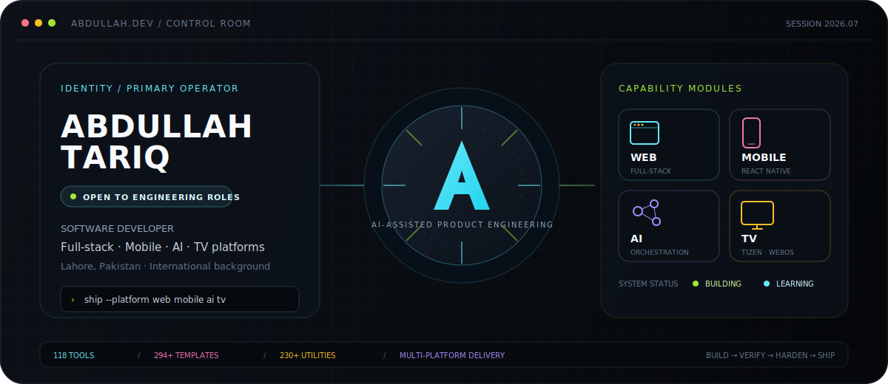
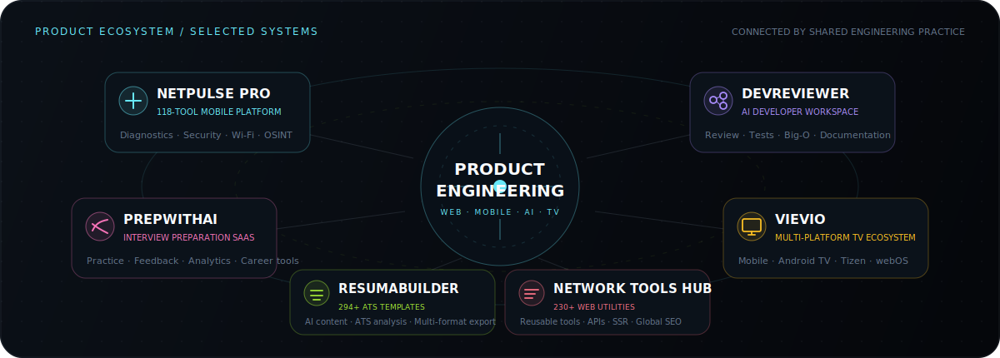
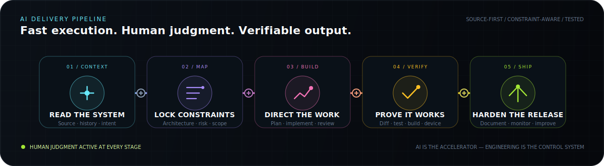

<p align="center">
  
</p>

<p align="center">
  <a href="https://abdullah25.fly.dev/"></a>
  <a href="https://www.linkedin.com/in/abdullah-bin-tariq-25at"></a>
  <a href="https://play.google.com/store/apps/details?id=com.abdullahtariq.netpulsepro"></a>
  <a href="mailto:abdullah.tariq.7654@gmail.com"></a>
  <a href="https://orcid.org/0009-0003-2603-5359"></a>
</p>

<p align="center">
  <strong>I build complete products across web, mobile, AI, backend, and television platforms.</strong><br />
  <sub>Source-first engineering · AI-assisted execution · Human-verified delivery</sub>
</p>

> [!IMPORTANT]
> **Open to software engineering opportunities** in full-stack development, React Native, AI applications, backend engineering, graduate programs, and internships — Lahore, hybrid, or remote.

---

## ◈ SYSTEM SNAPSHOT

<table>
  <tr>
    <td align="center" width="25%"><strong>118</strong><br /><sub>NetPulse Pro tools</sub></td>
    <td align="center" width="25%"><strong>294+</strong><br /><sub>ATS resume templates</sub></td>
    <td align="center" width="25%"><strong>230+</strong><br /><sub>Web utilities</sub></td>
    <td align="center" width="25%"><strong>4</strong><br /><sub>Product surfaces</sub></td>
  </tr>
</table>

```yaml
operator: Abdullah Tariq
location: Lahore, Pakistan
role: Software Developer
engineering_range:
  - Full-stack products and SaaS systems
  - React Native and Android applications
  - AI-integrated tools and workflows
  - Samsung Tizen, LG webOS, and Android TV
current_mode: Building startup products, client software, and independent systems
education: BS Computer Science — in progress
availability: Engineering roles, internships, and graduate opportunities
```

I work across the complete product lifecycle: **requirements, architecture, frontend, backend, mobile, AI integration, databases, testing, debugging, deployment, and release hardening**.

My strongest work appears where several engineering concerns meet—complex user flows, API-heavy systems, multiple platforms, constrained devices, AI-assisted features, and production reliability.

---

## ◈ PRODUCT ECOSYSTEM

<p align="center">
  
</p>

<table>
  <tr>
    <td width="50%" valign="top">
      <h3>⚡ NetPulse Pro</h3>
      <p> </p>
      <p>A React Native platform for network engineers, IT administrators, developers, cybersecurity learners, and technical users.</p>
      <ul>
        <li>118 diagnostic, lookup, Wi-Fi, privacy, security, OSINT, and utility tools.</li>
        <li>Unified configuration-driven tool architecture.</li>
        <li>SQLite history, persistent settings, exports, themes, tests, and native integrations.</li>
      </ul>
      <p><code>React Native</code> <code>Expo</code> <code>TypeScript</code> <code>Zustand</code> <code>SQLite</code></p>
      <p><a href="https://play.google.com/store/apps/details?id=com.abdullahtariq.netpulsepro"><strong>View on Google Play →</strong></a></p>
    </td>
    <td width="50%" valign="top">
      <h3>🧠 PrepWithAI</h3>
      <p> </p>
      <p>A structured interview-preparation product for technical and behavioral practice.</p>
      <ul>
        <li>DSA, system design, frontend, backend, DevOps, mobile, ML, and leadership tracks.</li>
        <li>Voice/video practice, Monaco coding workspace, analytics, reports, and career tools.</li>
        <li>Authentication, plan enforcement, Stripe billing, email, monitoring, and AI feedback.</li>
      </ul>
      <p><code>Next.js 16</code> <code>React 19</code> <code>MongoDB</code> <code>Groq</code> <code>Stripe</code></p>
      <p><a href="https://github.com/AbdullahTariq25/PrepWithAI"><strong>Explore repository →</strong></a></p>
    </td>
  </tr>
  <tr>
    <td width="50%" valign="top">
      <h3>🧬 DevReviewer</h3>
      <p> </p>
      <p>An AI engineering workspace for code review, testing, complexity analysis, documentation, and learning.</p>
      <ul>
        <li>Bug, security, anti-pattern, performance, and quality analysis.</li>
        <li>Test generation, Big-O analysis, multi-file review, documentation, chat, and auto-fix.</li>
        <li>Monaco editor, history, analytics, comparisons, public sharing, auth, and persistence.</li>
      </ul>
      <p><code>Next.js</code> <code>TypeScript</code> <code>Llama</code> <code>Groq</code> <code>MongoDB</code></p>
      <p><sub>Private while development and hardening continue.</sub></p>
    </td>
    <td width="50%" valign="top">
      <h3>📺 Vievio</h3>
      <p> </p>
      <p>A multi-platform IPTV ecosystem spanning applications, backend services, provider infrastructure, and operational panels.</p>
      <ul>
        <li>Web, React Native, Android TV, Samsung Tizen, and LG webOS clients.</li>
        <li>User, reseller, and admin systems with strict role separation.</li>
        <li>Provider management, device activation, playback recovery, source monitoring, and TV optimization.</li>
      </ul>
      <p><code>Next.js</code> <code>React Native</code> <code>Tizen</code> <code>webOS</code> <code>PostgreSQL</code> <code>Redis</code></p>
      <p><sub>Commercial repository is private.</sub></p>
    </td>
  </tr>
</table>

<details>
<summary><strong>Open the rest of the product lab</strong></summary>
<br />

| Product | Engineering focus |
|---|---|
| **ResumaBuilder** | 294+ ATS templates, Gemini content generation, ATS analysis, cloud/local persistence, PWA support, and PDF/Word/PNG/text exports. [Repository →](https://github.com/AbdullahTariq25/ResumaBuilder) |
| **Network Tools Hub** | 230+ networking, development, conversion, diagnostic, and technical utilities using reusable UI, APIs, SSR, and global SEO architecture. |
| **IPGeolocation.io Mobile App** | React Native contribution to a released GeoIP and network-utility application. [Google Play →](https://play.google.com/store/apps/details?id=io.ipgeolocation.app) |
| **HalalCheck** | Barcode/QR scanning, OCR ingredient analysis, E-code handling, offline Room storage, and multilingual Android flows. |
| **Domain Matching System** | Java and Spring Boot matching pipeline using exact, substring, abbreviation, scored, and CSV-processing rules. |
| **Library Management System** | Core Java, JDBC, PostgreSQL, authentication, roles, catalog, issue, and return workflows. [Repository →](https://github.com/AbdullahTariq25/LibraryManagementSystem25) |
| **Anonymous Feedback Platform** | Authentication, anonymous messaging, moderation-oriented flows, persistence, and AI-assisted suggestions. |

</details>

---

## ◈ AI-ASSISTED ENGINEERING

<p align="center">
  
</p>

> **AI is the accelerator. Engineering is the control system.**

| Operator rule | What it means in practice |
|---|---|
| **Read before changing** | Inspect source files, current behavior, history, architecture boundaries, and existing constraints. |
| **Map before building** | Separate hard requirements, risks, dependencies, affected surfaces, and verification steps. |
| **Direct, do not delegate blindly** | Use AI for navigation, comparison, implementation, debugging, documentation, and test design while retaining technical judgment. |
| **Verify every meaningful claim** | Review diffs, run type checks, tests, builds, logs, simulators, and physical-device validation where required. |
| **Preserve stable systems** | Improve targeted areas without rewriting known-good architecture for novelty. |
| **Ship with evidence** | Harden behavior, document decisions, surface limitations, and leave the codebase easier to continue. |

This workflow lets me coordinate AI across large codebases while keeping output **traceable, constraint-aware, technically grounded, and production-focused**.

---

## ◈ ENGINEERING CONSTELLATION

<p align="center">
  
</p>

<table>
  <tr>
    <td width="50%" valign="top">
      <h3>🌐 Product Engineering</h3>
      <p><kbd>Next.js</kbd> <kbd>React</kbd> <kbd>Vue.js</kbd> <kbd>TypeScript</kbd></p>
      <p>SaaS products, dashboards, admin systems, responsive interfaces, design systems, accessibility, SSR, SEO, performance, and product UX.</p>
    </td>
    <td width="50%" valign="top">
      <h3>📱 Mobile and Television</h3>
      <p><kbd>React Native</kbd> <kbd>Expo</kbd> <kbd>Android</kbd> <kbd>Tizen</kbd> <kbd>webOS</kbd></p>
      <p>Native modules, device APIs, media interfaces, remote navigation, offline state, constrained-device performance, and store delivery.</p>
    </td>
  </tr>
  <tr>
    <td width="50%" valign="top">
      <h3>🗄️ Backend and Data</h3>
      <p><kbd>Java</kbd> <kbd>Spring Boot</kbd> <kbd>Node.js</kbd> <kbd>REST APIs</kbd></p>
      <p>PostgreSQL, MongoDB, MySQL, Redis, SQLite, authentication, role systems, provider APIs, background workflows, and data modeling.</p>
    </td>
    <td width="50%" valign="top">
      <h3>🤖 AI, Quality and Delivery</h3>
      <p><kbd>Groq</kbd> <kbd>Llama</kbd> <kbd>Gemini</kbd> <kbd>GitHub Actions</kbd></p>
      <p>LLM integration, prompt systems, structured outputs, AI evaluation, testing, Docker, Vercel, debugging, QA, monitoring, and release hardening.</p>
    </td>
  </tr>
</table>

---

## ◈ EXPERIENCE SIGNAL

| Timeline | Role and impact |
|---|---|
| **2025 — Present** | **Independent Software Developer** — Building startup products and client systems across web, mobile, AI, TV applications, backend APIs, admin platforms, and production deployments, including work delivered through Taknea Solutions. |
| **Aug 2025 — Feb 2026** | **Software Developer Intern · JFreaks Software Solutions** — React Native delivery, Next.js platforms, API integration, SSR, debugging, performance optimization, SEO, Git collaboration, and release support. |
| **Feb 2026 — Apr 2026** | **AI Data Quality Analyst / Annotator · Shenzhen-Hong Kong Smart Hub** — Dataset annotation, validation, quality review, instruction-following checks, consistency analysis, and model-training support. |
| **Nov 2024 — Jun 2025** | **Software Project Contributor · Shenzhen Institute of Information Technology** — Vue.js and TypeScript project components, technical documentation, software coursework, and research-oriented implementation support in Shenzhen. |
| **Feb 2024 — Aug 2024** | **Frontend Developer Intern · JFreaks Software Solutions** — Responsive interfaces, JavaScript, API integration, debugging, Git, Java-related tasks, and practical development workflows. |

---

## ◈ EDUCATION AND CREDENTIALS

| Education | Status |
|---|---|
| **BS Computer Science** — Virtual University of Pakistan | Oct 2025 — Expected 2029 |
| **Sino-Pak Dual Diploma / DAE in Software Technology — Grade A** — SZIIT Shenzhen + PBTE / GCT Lahore | Completed 2025 |
| **Matriculation in Computer Science / Science** — Unique Group of Institutions, BISE Lahore | Completed 2022 |

**International background:** On-campus study in Shenzhen, China, from November 2024 to June 2025. Mandarin Chinese communication at approximately HSK 3 level.

<details>
<summary><strong>View certifications and training</strong></summary>
<br />

- **AI and prompting:** Google Prompting Essentials · Claude Code in Action — Anthropic · AI Trainer / Data Annotation Training.
- **Software and security:** Ethical Hacker · JavaScript Essentials 1 and 2 · Python Essentials 1 and 2 · HTML and CSS Essentials — Cisco Networking Academy.
- **Professional development:** Agile Project Management · Data Science and Analytics — HP Foundation.
- **Earlier training:** Front-End Development — JFreaks · Python — Tang International Education Group · Chinese Language Program.

</details>

---

## ◈ LIVE SIGNAL

<table>
  <tr>
    <td align="center" width="25%"><strong>BUILDING</strong><br /><sub>Startup and client products</sub></td>
    <td align="center" width="25%"><strong>IMPROVING</strong><br /><sub>Architecture and release quality</sub></td>
    <td align="center" width="25%"><strong>LEARNING</strong><br /><sub>CS, systems, and AI evaluation</sub></td>
    <td align="center" width="25%"><strong>SEEKING</strong><br /><sub>Meaningful engineering roles</sub></td>
  </tr>
</table>

<details>
<summary><strong>GitHub activity telemetry</strong></summary>
<br />
<p align="center">
  
</p>
<p align="center">
  
  
  
</p>
</details>

---

<div align="center">

## LET US BUILD SOMETHING THAT SURVIVES THE DEMO.

[**Email**](mailto:abdullah.tariq.7654@gmail.com) · [**LinkedIn**](https://www.linkedin.com/in/abdullah-bin-tariq-25at) · [**Portfolio**](https://abdullah25.fly.dev/) · [**Google Play**](https://play.google.com/store/apps/details?id=com.abdullahtariq.netpulsepro)

<sub>Lahore, Pakistan · English · Urdu · Mandarin Chinese</sub>

</div>
